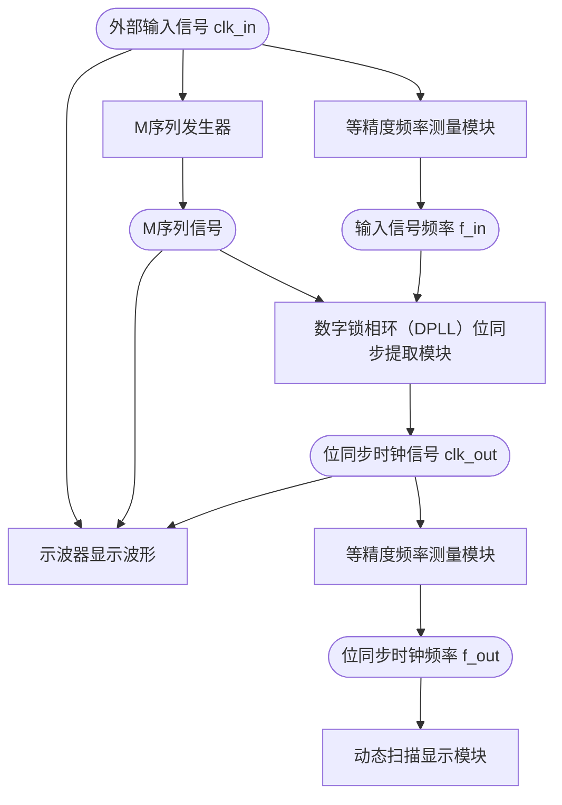

# Clock-Recovery-from-M-Sequence-with-DPLL
一个利用数字锁相环（DPLL）从 M 序列中恢复出位同步时钟信号的课程设计，可以开袋即食喵

> NJUPT 通信工程专业电子电路课程设计题目

# 1. 系统简介
本设计基于 Xilinx ISE 14.7 开发环境和 EVM31 v2.0 开发板，以 Xilinx Spartan-3 系列的 FPGA 芯片 XC3S50AN-PLCC144-4 为目标器件，实现了一个从二进制基带信号中提取位同步时钟信号的完整系统。

通过硬件描述语言 Verilog HDL 编程，系统集成了 **M 序列发生器**、**数字锁相环（DPLL）位同步提取模块**、**等精度频率测量模块**和**动态扫描显示模块**。

- **M 序列发生器** 部分，采用 $f(x)=x^8+x^4+x^3+x^2+1$ 作为本原多项式
- **数字锁相环（DPLL）** 部分，主要调节参数为 $KP$ 和 $KI$（在 `dpll_clock_recovery.v` 中可以找到这两个参数），以及系统时钟信号的频率参数（代码中所有和系统时钟相关的参数都写死为 2MHz，如需改变系统时钟频率请**注意修改参数**）
- **等精度频率测量模块** 部分，本人采用 1s 时长的时间窗口、2MHz 的基准信号来对待测信号进行测频
- **动态扫描显示模块** 部分，使用了 Double Dabble 算法将测频模块得到的二进制频率转化为易于显示的 BCD 表示形式，具体逻辑请参考代码实现

系统结构图如下所示：



# 2. 代码结构
```terminal
└── top.v                       # 顶层模块
    ├── m_sequence_generator.v  # M 序列信号发生器
    ├── display.v               # 动态扫描显示mok
    ├── dpll_clock_recovery.v   # 数字锁相环位同步信号提取模块
    └── max_clock_recovery.v    # 最大脉宽法位同步信号提取模块（用作对照）
```

至于**等精度频率测量模块**，小生将这部分嵌入到了 `display.v` 和 `dpll_clock_recovery.v` 文件中，可以自行打开查看
